# 日常工具助手

日常工具助手是一款桌面效率工具，帮你管理**计划任务**和**定时提醒**，让日常工作生活更有条理。

---

## 目录

1. [快速开始](#1-快速开始)
2. [计划管理](#2-计划管理)
3. [提醒管理](#3-提醒管理)
4. [条码管理](#4-条码管理)
5. [图片水印](#5-图片水印)
6. [通知弹窗](#6-通知弹窗)
7. [设置](#7-设置)
8. [更新日志](#8-更新日志)
9. [常见问题](#9-常见问题)

---

## 1. 快速开始

### 下载地址

https://github.com/zcrkey/tool-helper-updater/releases

### 安装与启动

下载安装包完成安装后，双击桌面图标启动应用。

应用启动后会在**系统托盘**（屏幕右下角）显示图标。

关闭窗口只是隐藏界面，应用仍在后台运行。需要彻底退出时，有以下两种方式：

- 在主界面左下角点击"退出"按钮

  
- 右键托盘图标选择"退出程序"

  

## 2. 计划管理

计划页是管理日常待办事项的核心，分为**日历**和**列表**两种视图。

### 2.1 新建计划

点击页面右上角的"新建计划"按钮，在弹出的抽屉中填写：

- **标题** — 计划要做的事情
- **描述** — 补充说明或备注
- **分类** — 归到某个分类下，方便筛选
- **优先级** — 标记事项的重要程度（无、低、中、高、紧急）
- **时间类型** — 选择该计划是否有具体时间
- **开始/结束时间** — 根据时间类型填入
- **提醒时间** — 设置后到点会弹窗通知你

**时间类型说明：**

| 类型       | 用法                             | 示例                       |
| ---------- | -------------------------------- | -------------------------- |
| 无时间     | 只是一个待办，不占用日历时段     | "读《设计模式》"           |
| 仅日期     | 知道哪天要做，但不固定几点       | "6月11日购买生日礼物"      |
| 具体时间段 | 有明确的起止时间                 | "14:00-17:00 完成项目报告" |
| 全天事项   | 占用一整天，日历中显示为全天色块 | "6月12日团建活动"          |

### 2.2 优先级

| 优先级 | 什么时候用                 |
| ------ | -------------------------- |
| 无     | 日常琐事、可做可不做的事   |
| 低     | 不着急，有空再处理         |
| 中     | 常规工作任务               |
| 高     | 重要、有 deadline 压力     |
| 紧急   | 需要马上处理的（截止迫近） |

### 2.3 分类管理

在计划页顶部可以管理分类。你可以新增、重命名、排序或删除分类。每个计划只能归到一个分类下。

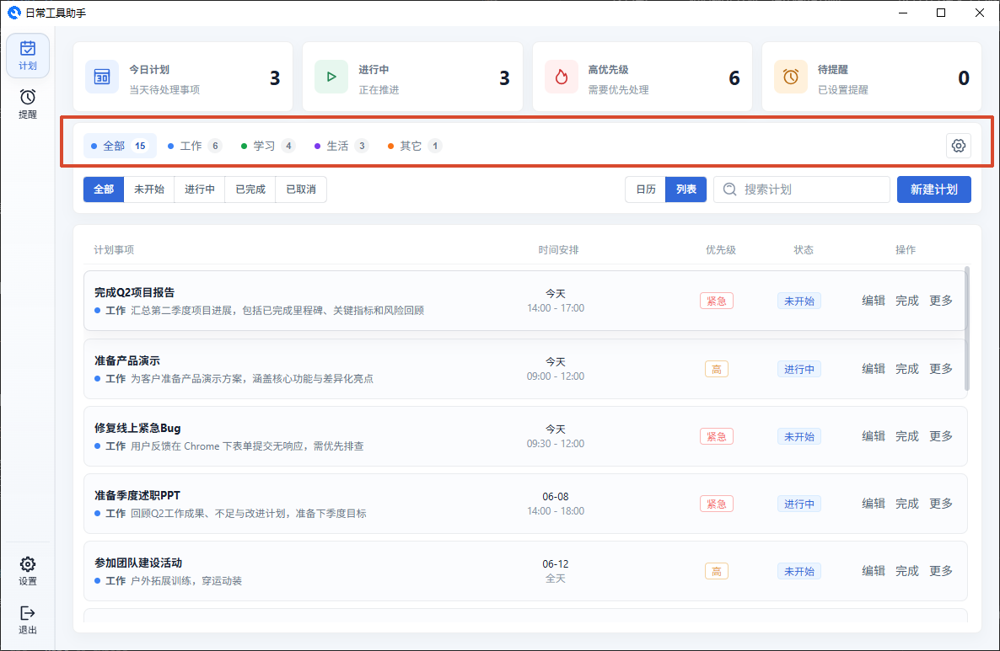

## 3. 提醒管理

提醒是到时间自动弹窗通知你的事项。相比计划中的提醒，它更灵活，支持多种重复规则。

### 3.1 新建提醒

点击"新建提醒"，在抽屉中填写：

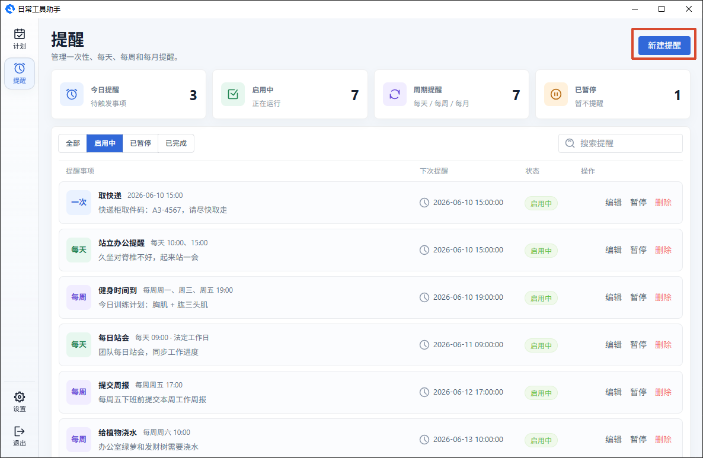

- **标题** — 提醒的内容
- **启用状态** — 开启后到点才会触发，临时不需要可以"暂停"
- **内容** — 更详细的说明
- **提醒类型** — 选择触发方式（一次性、每天、每周、每月）
- **提醒时间** — 根据类型填入具体时间
- **通知模式** — 弹窗的行为方式（短暂提醒、常驻提醒、紧急提醒）

### 3.2 提醒类型

| 类型   | 适合场景                       | 如何设置时间       |
| ------ | ------------------------------ | ------------------ |
| 一次性 | 取快递、交报名费等只提醒一次的 | 选具体日期和时间   |
| 每天   | 每日站会、吃药等每天固定时间   | 选一个或多个时间点 |
| 每周   | 周报、健身等每周固定几天       | 选星期几 + 时间点  |
| 每月   | 月度总结、缴费等每月固定日期   | 选几号 + 时间点    |

### 3.3 通知模式

这是提醒弹窗的"脾气"——决定它怎么出现在你面前：

| 模式               | 弹窗表现                              | 适合用来             |
| ------------------ | ------------------------------------- | -------------------- |
| **短暂提醒** | 右下角出现，几秒后自动消失            | 一般提醒，看到就行   |
| **常驻提醒** | 右下角出现，不消失直到你手动关        | 需要你确认的重要事项 |
| **紧急提醒** | 右下角出现 + 自动把应用窗口弹到最前面 | 开会等必须立即响应的 |

### 3.4 列表操作

提醒列表中的每一条都可以：

- **编辑** — 修改提醒内容
- **启用/暂停** — 临时开关，不影响已设置的数据
- **删除** — 彻底移除

---

## 4. 条码管理

条码页用于离线生成和识别常用静态码，当前支持 **QR Code** 和 **Code 128**。所有内容、Logo 和图片都只在本地处理，不会上传到云端。

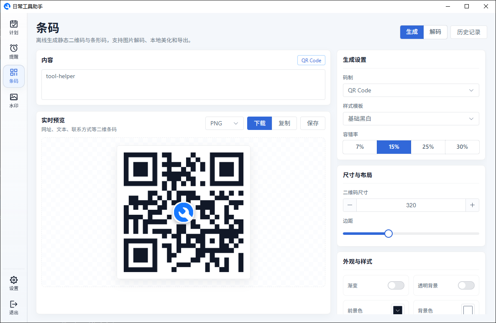

条码管理分为两个模式：

- **生成** — 输入内容后实时生成二维码或条形码，可调整样式并导出图片
- **解码** — 上传、拖拽或粘贴图片，识别其中的二维码或条形码内容

### 4.1 生成条码

在"生成"模式中，左侧是内容输入和实时预览，右侧是参数面板。

生成 QR Code 时可以配置：

- **码制** — 当前支持 QR Code 和 Code 128
- **样式模板** — 选择基础黑白、简单标签、Logo 标识、圆点、圆角、渐变颜色等预设
- **二维码尺寸** — 控制生成图片的实际尺寸
- **边距** — 控制码图四周留白
- **颜色样式** — 设置前景色、背景色、透明背景和渐变
- **码点与码眼** — 设置码点形状、码眼外框、码眼中心和码眼颜色
- **容错率** — 控制二维码被遮挡或污损后的识别能力
- **Logo** — 上传本地 Logo，并设置形状、位置、投影和尺寸
- **文字说明** — 在二维码下方显示自定义说明文字

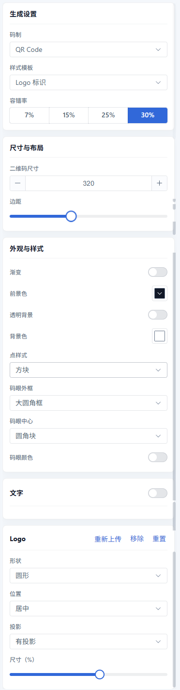

生成 Code 128 时可以配置：

- **条宽** — 控制条码线条宽度
- **条高** — 控制条码整体高度
- **边距** — 控制条码四周留白
- **显示文字** — 控制是否在条码下方显示原始内容
- **文字大小** — 调整条码文字字号
- **文字间距** — 调整文字和条码之间的距离

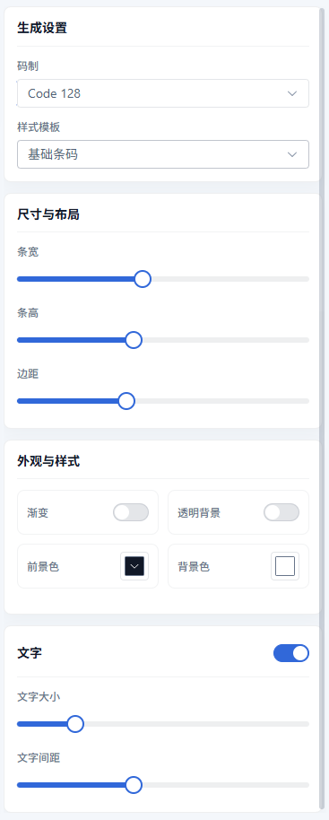

实时预览区域支持：

- **导出 PNG / JPG** — 将当前生成结果保存为图片
- **复制图片** — 将当前生成结果复制到剪贴板
- **保存记录** — 将当前内容、码制和样式配置保存到历史记录

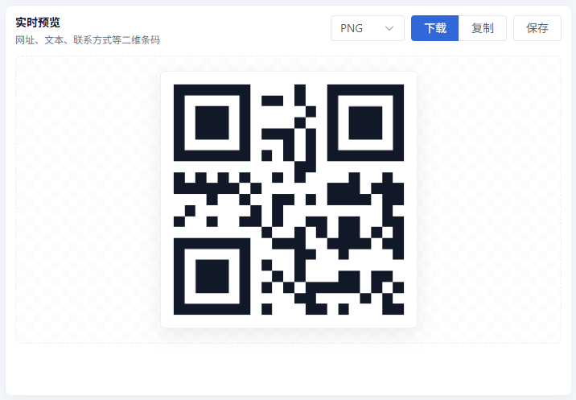
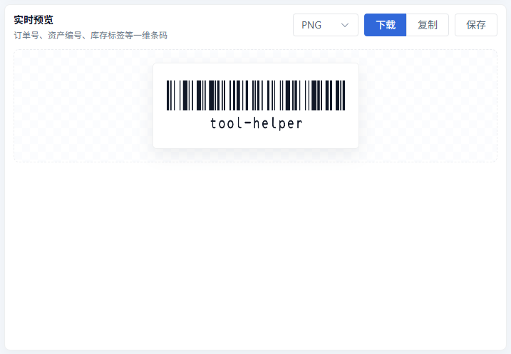

### 4.2 解码图片

切换到"解码"模式后，可以识别本地图片中的二维码或条形码。

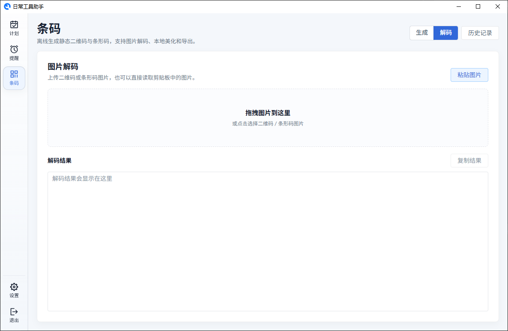

支持三种图片输入方式：

- **拖拽图片** — 将图片直接拖入上传区域
- **选择图片** — 点击上传区域，从本地选择图片
- **粘贴图片** — 从剪贴板读取图片并自动识别

识别成功后，结果会显示在解码结果框中，可以一键复制结果内容。

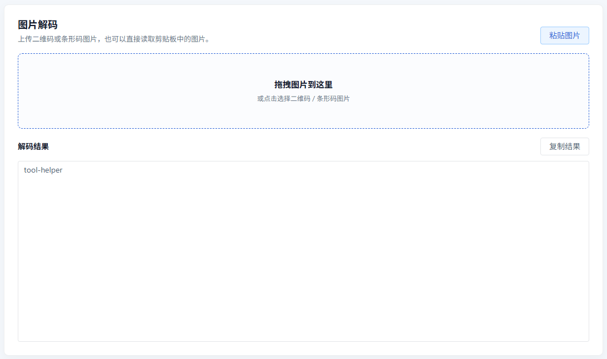

### 4.3 历史记录

点击页面右上角的"历史记录"按钮，可以打开历史记录抽屉。

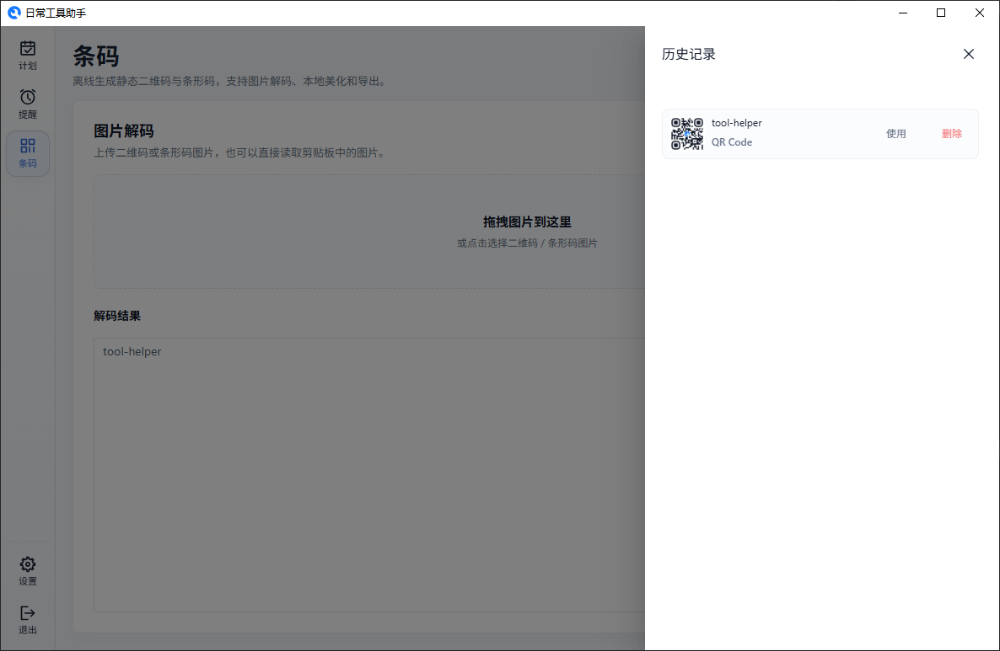

历史记录中可以：

- **使用** — 将历史记录中的内容和样式配置回填到当前工作台
- **删除** — 移除不再需要的历史记录

历史记录适合保存常用设备码、活动码、资产编号、订单号等固定内容，后续可以快速复用。

## 5. 图片水印

水印页用于在本地给图片添加文字水印或图片/Logo 水印。原图、水印图片和导出结果都只在本地处理，不会上传到云端。

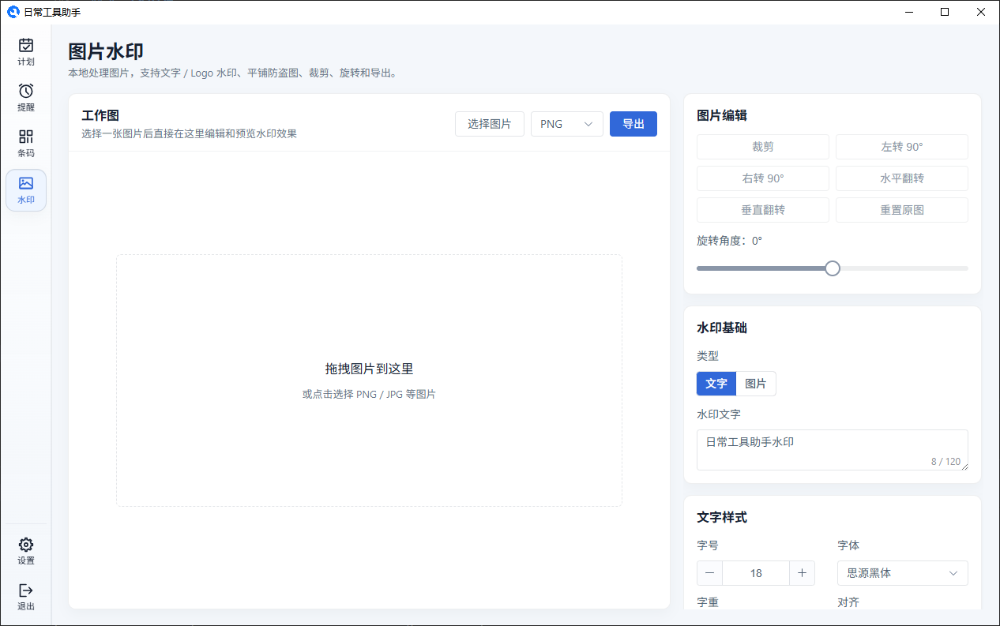
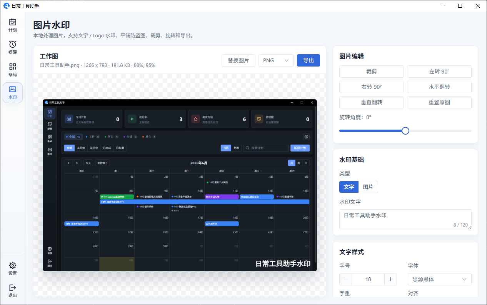

水印工作台分为左侧预览区和右侧设置区：

- **预览区** — 上传原图后实时查看水印效果，单个水印可以直接拖拽调整位置
- **设置区** — 调整图片编辑、水印内容、样式、布局和导出参数

### 5.1 上传图片与导出

进入水印页后，可以将图片拖拽到工作区，也可以点击"选择图片"从本地选择 PNG、JPG 等图片文件。
上传图片后，页面会显示图片名称、尺寸和文件大小。设置完成后，在预览区右上角选择导出格式，再点击"导出"保存到本地。

- **PNG** — 适合需要保留高质量或透明效果的图片
- **JPG** — 适合照片类图片，文件体积通常更小

### 5.2 图片编辑

右侧"图片编辑"区域可以在加水印前先调整原图。

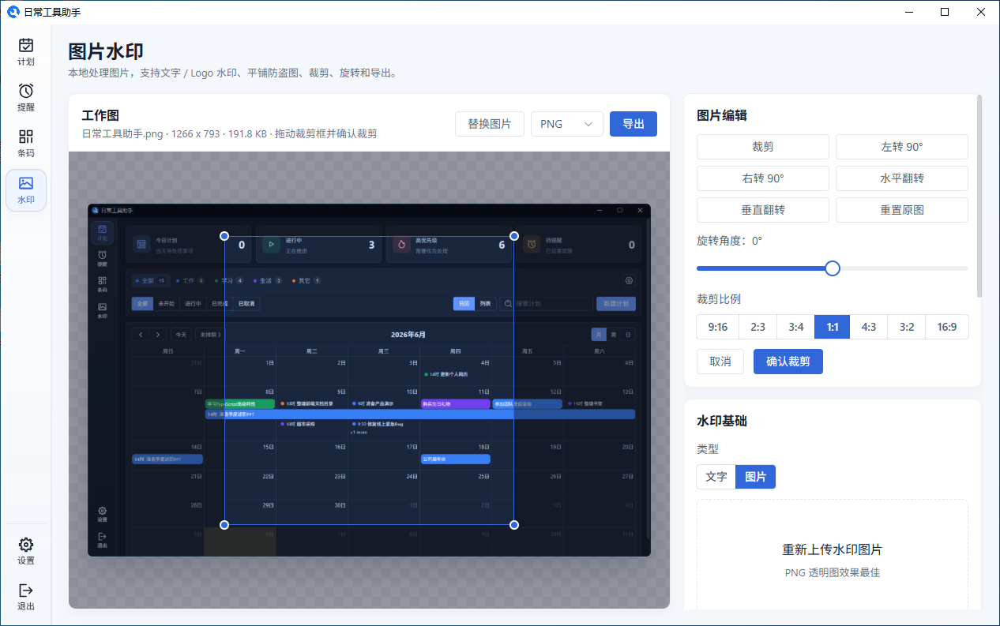

支持的编辑操作包括：

- **裁剪** — 开启裁剪框后拖拽调整范围，再点击"确认裁剪"
- **裁剪比例** — 裁剪时可选择 9:16、2:3、3:4、1:1、4:3、3:2、16:9 等固定比例
- **左转 / 右转 90°** — 快速旋转图片方向
- **旋转角度** — 通过滑块设置 -180° 到 180° 的自定义旋转
- **水平翻转 / 垂直翻转** — 镜像调整图片方向
- **重置原图** — 清除裁剪、旋转和翻转，恢复到上传后的原始状态

### 5.3 水印基础

在"水印基础"区域选择水印类型。

- **文字** — 输入自定义水印文字，适合添加姓名、版权、用途说明或时间标记
  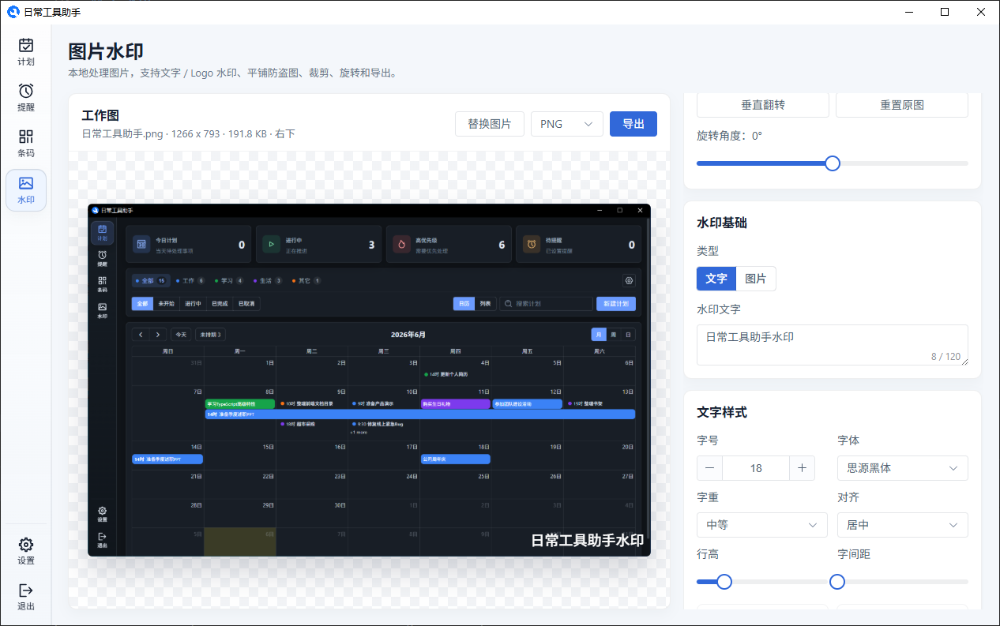
- **图片** — 上传 Logo 或水印图，透明 PNG 效果更好
  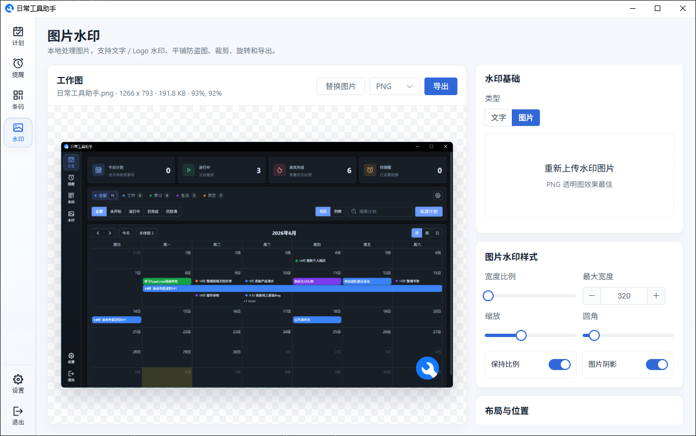

文字水印支持多行内容，图片水印可以随时重新上传替换。

### 5.4 文字水印样式

选择"文字"类型后，可以在"文字样式"区域调整文字外观。

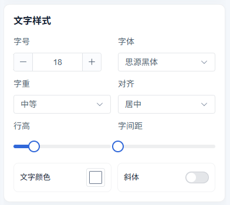

常用配置包括：

- **字号、字体、字重、斜体** — 控制文字基础形态
- **对齐、行高、字间距** — 调整多行文字的排版效果
- **文字颜色** — 支持透明度，页面会根据图片亮度推荐更清晰的默认颜色
- **描边** — 给文字增加外轮廓，提升复杂背景上的可读性
- **阴影** — 增加阴影颜色、模糊和偏移，让文字更有层次
- **背景** — 给文字增加半透明背景、圆角和内边距，适合浅色或花纹较多的图片

### 5.5 图片水印样式

选择"图片"类型后，可以在"图片水印样式"区域调整 Logo 或水印图。

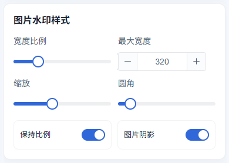

可配置内容包括：

- **宽度比例** — 按原图宽度设置水印图片占比
- **最大宽度** — 限制水印图片在大图上的最大显示宽度
- **缩放** — 在当前比例基础上继续放大或缩小
- **圆角** — 给水印图片增加圆角
- **保持比例** — 避免水印图片被拉伸变形
- **图片阴影** — 给 Logo 增加投影效果

### 5.6 布局与位置

在"布局与位置"区域可以选择单个水印或平铺水印。

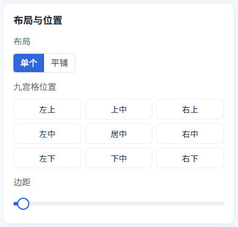
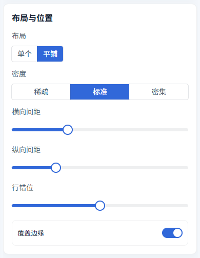

**单个水印**适合在角落放置 Logo 或版权文字：

- 通过九宫格选择左上、上中、右上、左中、居中、右中、左下、下中、右下位置
- 通过"边距"调整水印与图片边缘的距离
- 在预览区直接拖拽水印，可以调整为自定义位置

**平铺水印**适合做防盗图或批量素材标记：

- **密度** — 可选择稀疏、标准或密集
- **横向间距 / 纵向间距** — 调整每个水印之间的距离
- **行错位** — 让相邻行错开，减少机械重复感
- **边缘覆盖** — 让水印覆盖到图片边缘，减少被裁掉水印的风险

### 5.7 通用效果

无论文字水印还是图片水印，都可以继续调整通用效果。

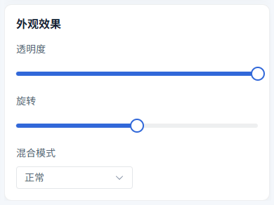

- **透明度** — 控制水印显眼程度，数值越低越淡
- **缩放** — 控制水印整体大小
- **旋转** — 让水印倾斜显示，平铺防盗图常用轻微旋转
- **混合模式** — 支持正常、正片叠底、叠加、柔光等效果，可根据图片明暗选择更自然的融合方式

调整参数后，左侧预览会自动刷新。导出时会按当前预览效果生成最终图片。

---

## 6. 通知弹窗

提醒触发时，屏幕右下角会弹出一个通知窗口：

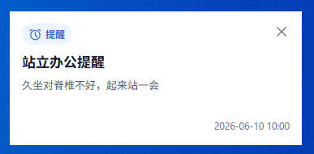

弹窗的交互方式：

| 操作                   | 效果                           |
| ---------------------- | ------------------------------ |
| 点击内容区域           | 跳转到对应的详情页查看完整信息 |
| 点击右上角 ✕          | 关闭弹窗                       |
| 什么都不做（短暂提醒） | 约 12 秒后自动消失             |

提醒触发时，任务栏的应用图标也会闪烁，吸引你注意。

---

## 7. 设置

### 7.1 外观

三种主题可选：

- **跟随系统** — 自动和系统的浅色/深色模式保持一致
- **浅色模式** — 浅灰页面背景
- **深色模式** — 深色背景，适合暗光环境

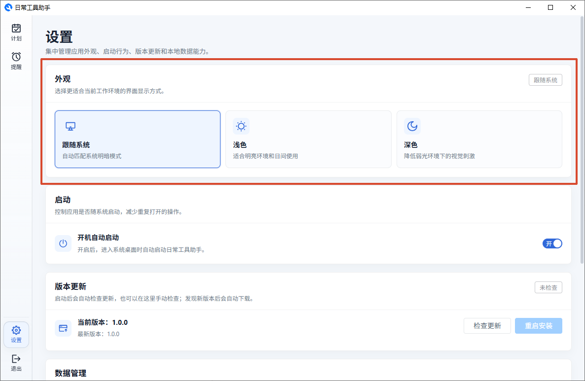

切换即时生效，不需要重启。

### 7.2 启动

- **开机自动启动** — 开启后登录系统时会自动运行应用

### 7.3 数据管理

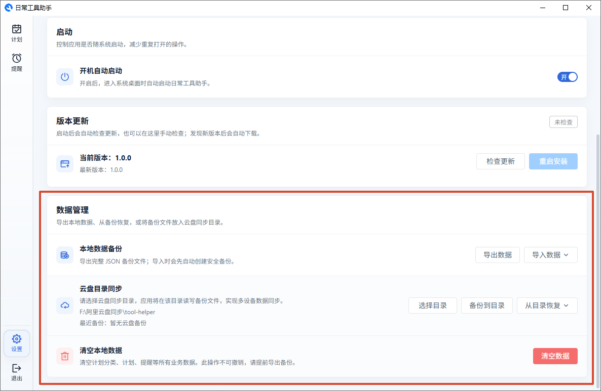

**导出数据：** 将你的所有计划、提醒等数据保存为一个 JSON 文件，可以存到安全位置。

**导入数据：**

| 模式     | 效果                           |
| -------- | ------------------------------ |
| 合并导入 | 保留已有数据，加入新数据       |
| 覆盖导入 | 清空所有数据，替换为导入的文件 |

> 不管哪种方式，导入前都会自动帮你备份一份当前数据。

**云盘同步：** 如果你在多台电脑上用，可以用这个方法：

1. **选择目录** — 选一个云盘（如 OneDrive）的本地文件夹
2. **备份到目录** — 把当前数据存一份到那里
3. **从目录恢复** — 从文件夹里的最新备份恢复到这台电脑

**清空本地数据：** 将你的所有计划、提醒等数据全部清空。

### 7.4 版本更新

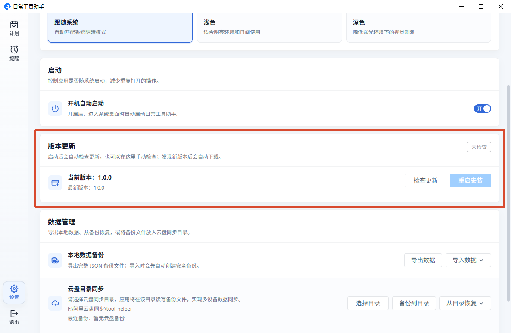

- 启动时会自动检查有没有新版本
- 也可以手动点击"检查更新"
- 发现新版本会自动下载，下载完成后点"重启安装"完成更新

---

## 8. 更新日志

[点击查看更新日志](./CHANGELOG.md)

## 9. 常见问题

**问：我关了窗口，但应用还在？**

这是正常设计。关闭窗口只是隐藏界面，应用仍在后台运行。需要彻底退出时，有以下两种方式：

- 在主界面左下角点击"退出"按钮
- 右键托盘图标选择"退出程序"

**问：到时间了提醒没有弹出来？**

请检查：

1. 提醒状态是否为"启用中"
2. 下次触发时间是否正确

**问：我的数据安全吗？**

所有数据存储在本地电脑上，不会自动上传到任何云端。你可以手动导出备份文件存到安全位置。
