# 日常工具助手

日常工具助手是一款桌面效率工具，帮你管理**计划任务**和**定时提醒**，让日常工作生活更有条理。

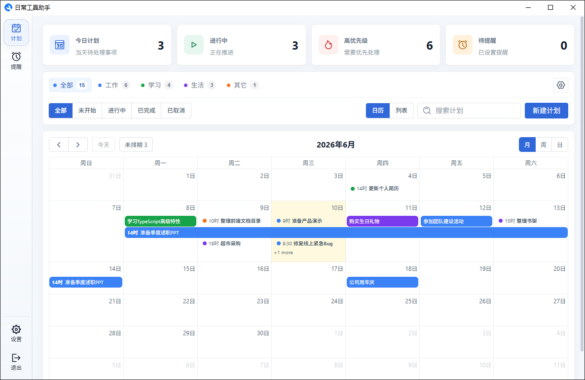

---

## 目录

1. [快速开始](#1-快速开始)
2. [计划管理](#2-计划管理)
3. [提醒管理](#3-提醒管理)
4. [通知弹窗](#4-通知弹窗)
5. [设置](#5-设置)
6. [更新日志](#6-更新日志)
7. [常见问题](#7-常见问题)

---

## 1. 快速开始

### 下载地址

https://github.com/zcrkey/tool-helper-updater/releases

### 安装与启动

下载安装包完成安装后，双击桌面图标启动应用。

应用启动后会在**系统托盘**（屏幕右下角）显示图标。

关闭窗口只是隐藏界面，应用仍在后台运行。需要彻底退出时，有以下两种方式：

- 在主界面左下角点击"退出"按钮

  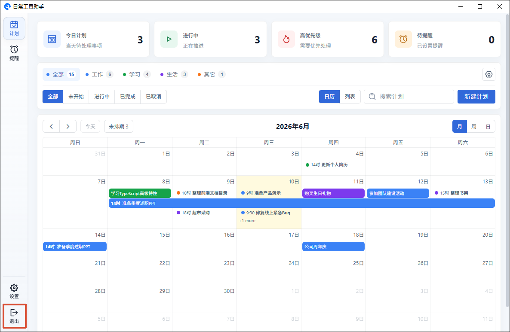

- 右键托盘图标选择"退出程序"

  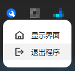

## 2. 计划管理

计划页是管理日常待办事项的核心，分为**日历**和**列表**两种视图。

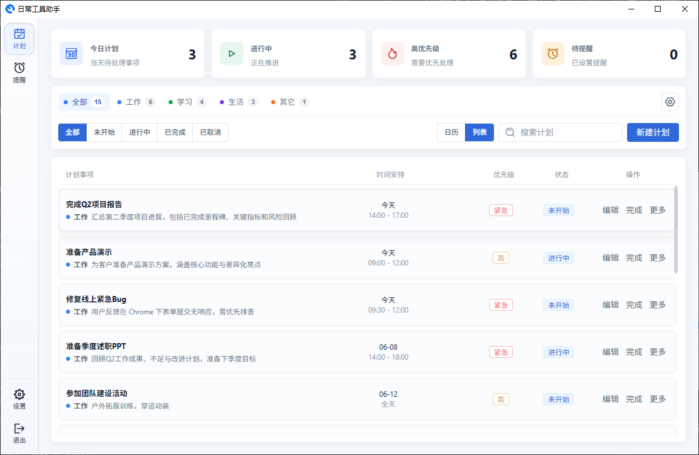

### 2.1 新建计划

点击页面右上角的"新建计划"按钮，在弹出的抽屉中填写：

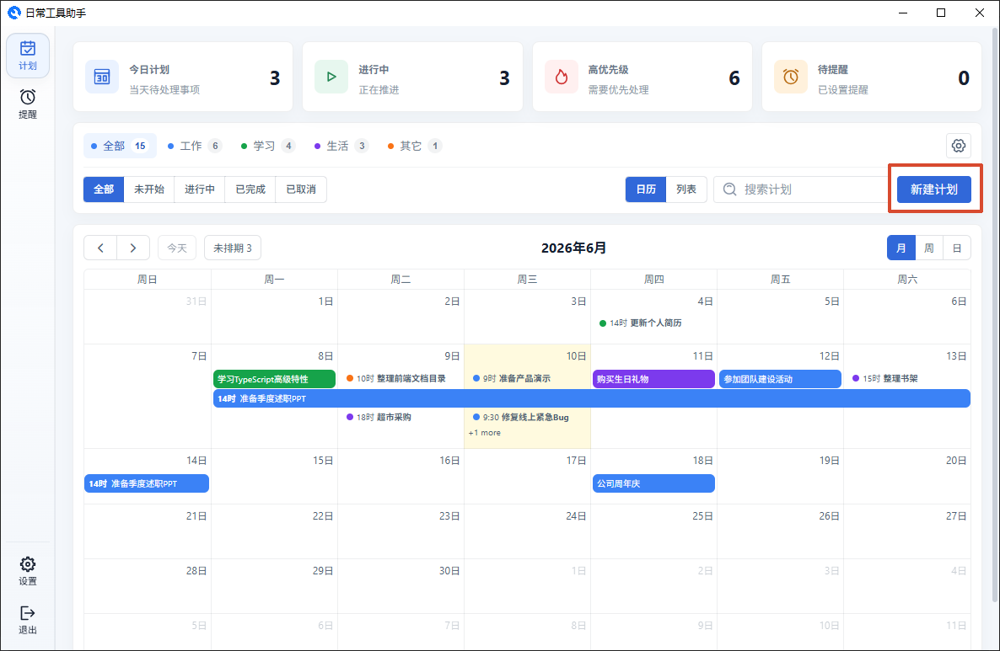
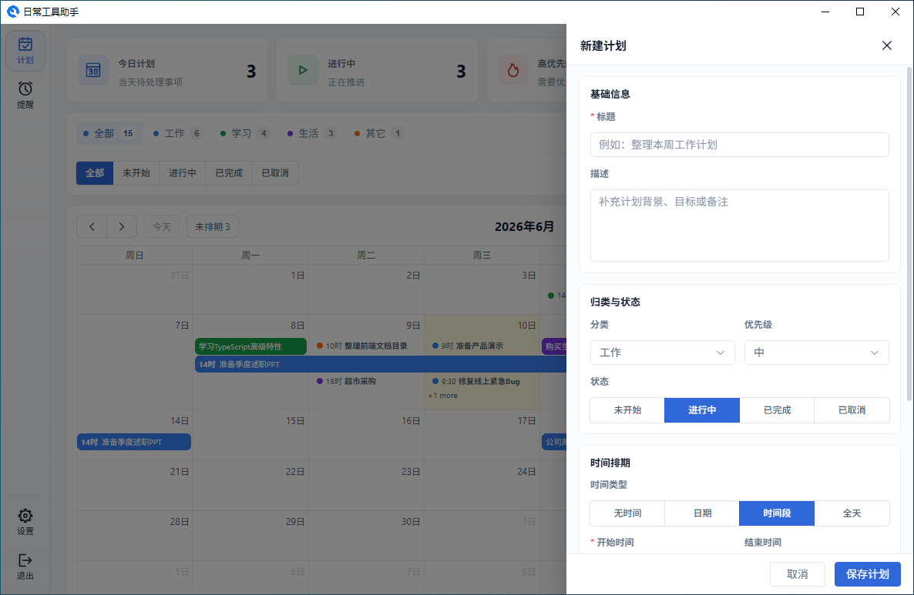

- **标题** — 计划要做的事情
- **描述** — 补充说明或备注
- **分类** — 归到某个分类下，方便筛选
- **优先级** — 标记事项的重要程度（无、低、中、高、紧急）
- **时间类型** — 选择该计划是否有具体时间
- **开始/结束时间** — 根据时间类型填入
- **提醒时间** — 设置后到点会弹窗通知你

**时间类型说明：**

| 类型       | 用法                             | 示例                       |
| ---------- | -------------------------------- | -------------------------- |
| 无时间     | 只是一个待办，不占用日历时段     | "读《设计模式》"           |
| 仅日期     | 知道哪天要做，但不固定几点       | "6月11日购买生日礼物"      |
| 具体时间段 | 有明确的起止时间                 | "14:00-17:00 完成项目报告" |
| 全天事项   | 占用一整天，日历中显示为全天色块 | "6月12日团建活动"          |

### 2.2 优先级

| 优先级 | 什么时候用                 |
| ------ | -------------------------- |
| 无     | 日常琐事、可做可不做的事   |
| 低     | 不着急，有空再处理         |
| 中     | 常规工作任务               |
| 高     | 重要、有 deadline 压力     |
| 紧急   | 需要马上处理的（截止迫近） |

### 2.3 分类管理

在计划页顶部可以管理分类。你可以新增、重命名、排序或删除分类。每个计划只能归到一个分类下。

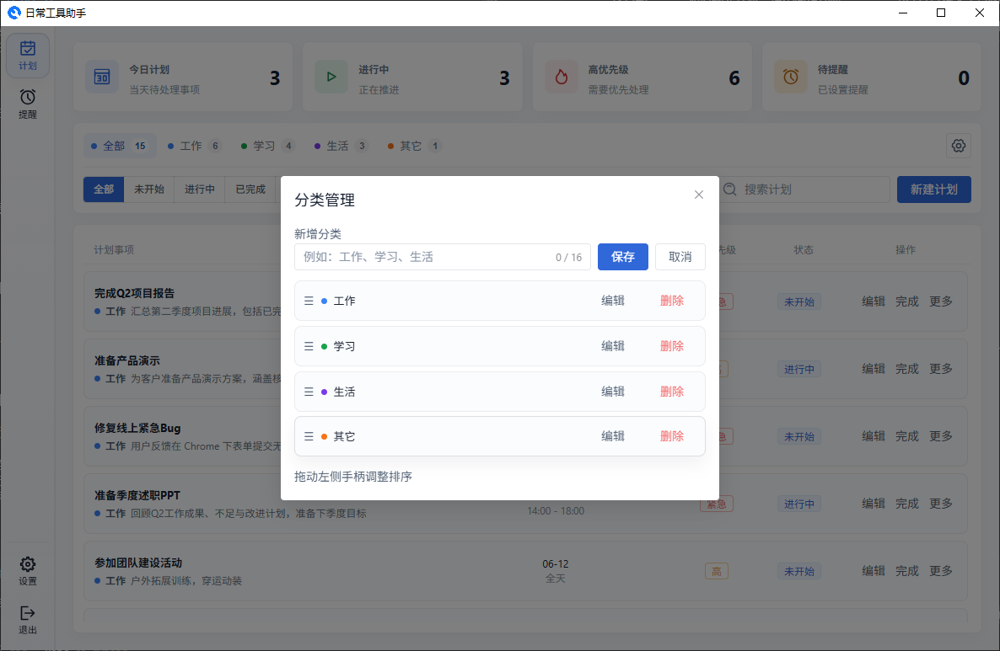

## 3. 提醒管理

提醒是到时间自动弹窗通知你的事项。相比计划中的提醒，它更灵活，支持多种重复规则。

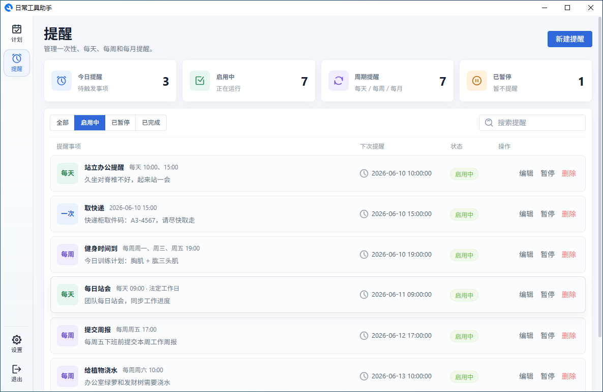

### 3.1 新建提醒

点击"新建提醒"，在抽屉中填写：

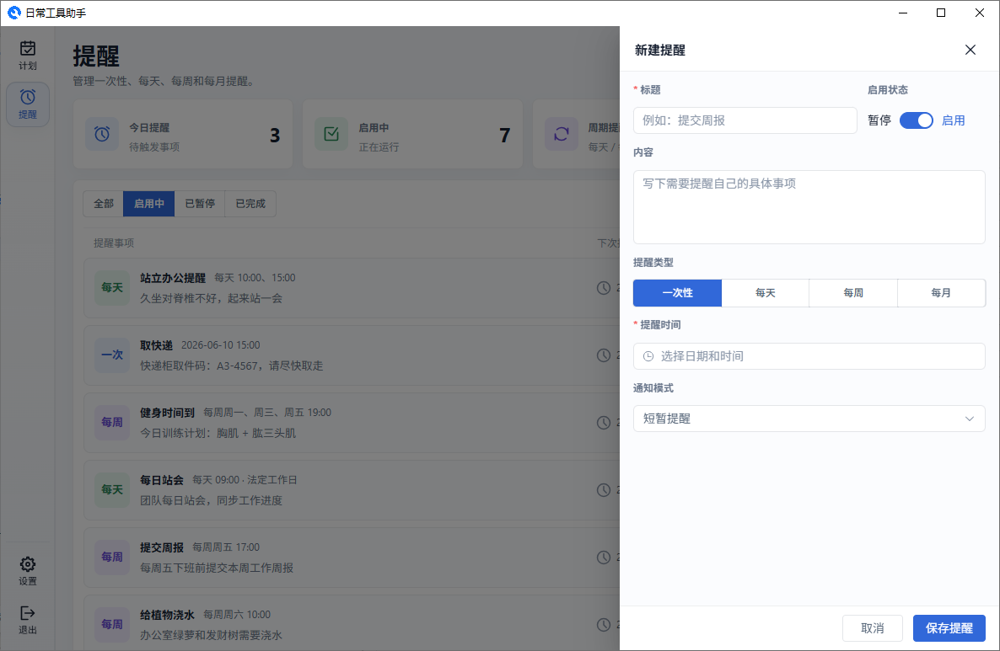

- **标题** — 提醒的内容
- **启用状态** — 开启后到点才会触发，临时不需要可以"暂停"
- **内容** — 更详细的说明
- **提醒类型** — 选择触发方式（一次性、每天、每周、每月）
- **提醒时间** — 根据类型填入具体时间
- **通知模式** — 弹窗的行为方式（短暂提醒、常驻提醒、紧急提醒）

### 3.2 提醒类型

| 类型   | 适合场景                       | 如何设置时间       |
| ------ | ------------------------------ | ------------------ |
| 一次性 | 取快递、交报名费等只提醒一次的 | 选具体日期和时间   |
| 每天   | 每日站会、吃药等每天固定时间   | 选一个或多个时间点 |
| 每周   | 周报、健身等每周固定几天       | 选星期几 + 时间点  |
| 每月   | 月度总结、缴费等每月固定日期   | 选几号 + 时间点    |

### 3.3 通知模式

这是提醒弹窗的"脾气"——决定它怎么出现在你面前：

| 模式         | 弹窗表现                              | 适合用来                   |
| ------------ | ------------------------------------- | -------------------------- |
| **短暂提醒** | 右下角出现，几秒后自动消失            | 一般提醒，看到就行         |
| **常驻提醒** | 右下角出现，不消失直到你手动关        | 需要你确认的重要事项       |
| **紧急提醒** | 右下角出现 + 自动把应用窗口弹到最前面 | 开会等必须立即响应的 |

### 3.4 列表操作

提醒列表中的每一条都可以：

- **编辑** — 修改提醒内容
- **启用/暂停** — 临时开关，不影响已设置的数据
- **删除** — 彻底移除

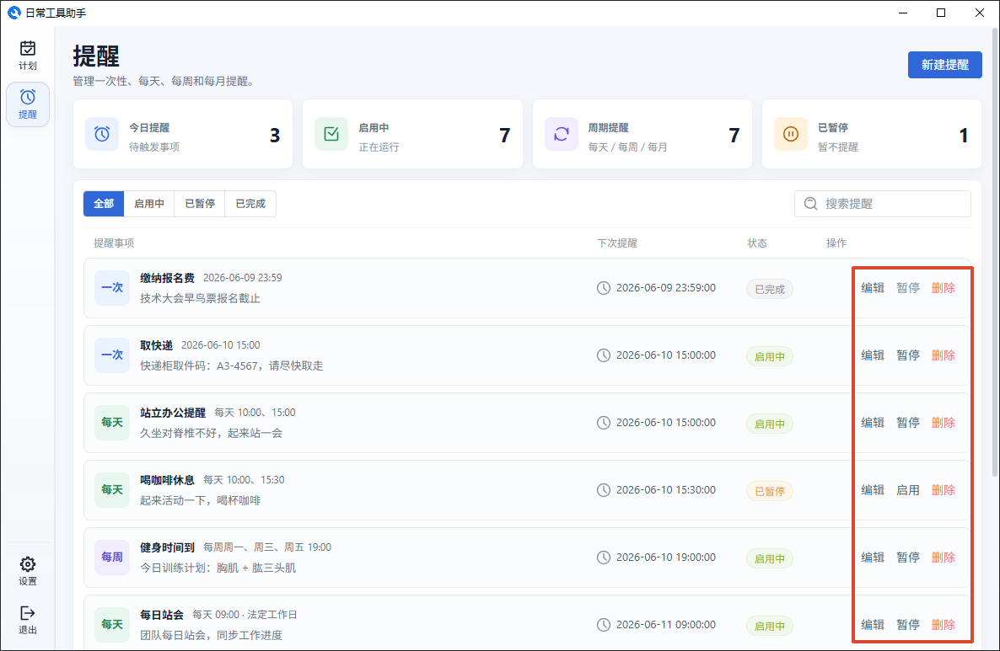

---

## 4. 通知弹窗

提醒触发时，屏幕右下角会弹出一个通知窗口：

弹窗的交互方式：

| 操作                   | 效果                           |
| ---------------------- | ------------------------------ |
| 点击内容区域           | 跳转到对应的详情页查看完整信息 |
| 点击右上角 ✕           | 关闭弹窗                       |
| 什么都不做（短暂提醒） | 约 12 秒后自动消失             |

提醒触发时，任务栏的应用图标也会闪烁，吸引你注意。

---

## 5. 设置

### 5.1 外观

三种主题可选：

- **跟随系统** — 自动和系统的浅色/深色模式保持一致
- **浅色模式** — 浅灰页面背景
- **深色模式** — 深色背景，适合暗光环境

切换即时生效，不需要重启。

### 5.2 启动

- **开机自动启动** — 开启后登录系统时会自动运行应用

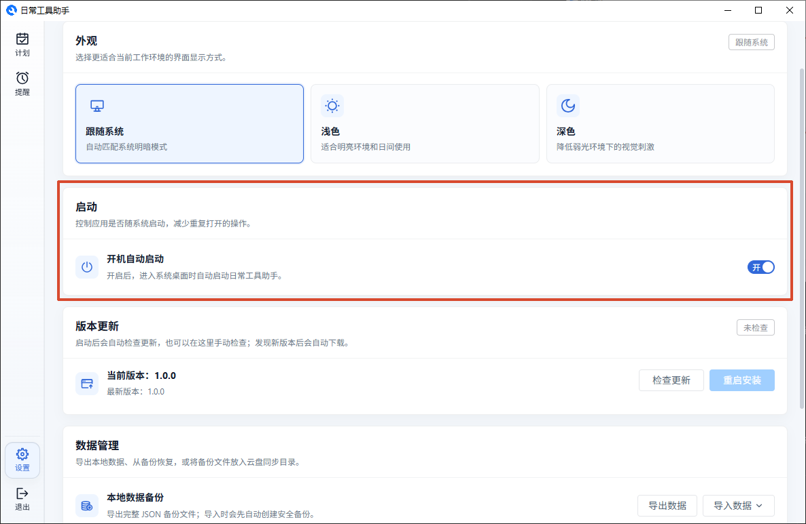

### 5.3 数据管理

**导出数据：** 将你的所有计划、提醒等数据保存为一个 JSON 文件，可以存到安全位置。

**导入数据：**

| 模式     | 效果                           |
| -------- | ------------------------------ |
| 合并导入 | 保留已有数据，加入新数据       |
| 覆盖导入 | 清空所有数据，替换为导入的文件 |

> 不管哪种方式，导入前都会自动帮你备份一份当前数据。

**云盘同步：** 如果你在多台电脑上用，可以用这个方法：

1. **选择目录** — 选一个云盘（如 OneDrive）的本地文件夹
2. **备份到目录** — 把当前数据存一份到那里
3. **从目录恢复** — 从文件夹里的最新备份恢复到这台电脑

**清空本地数据：** 将你的所有计划、提醒等数据全部清空。

### 5.4 版本更新

- 启动时会自动检查有没有新版本
- 也可以手动点击"检查更新"
- 发现新版本会自动下载，下载完成后点"重启安装"完成更新

---

## 6. 更新日志

[点击查看更新日志](./CHANGELOG.md)

## 7. 常见问题

**问：我关了窗口，但应用还在？**

这是正常设计。关闭窗口只是隐藏界面，应用仍在后台运行。需要彻底退出时，有以下两种方式：

- 在主界面左下角点击"退出"按钮
- 右键托盘图标选择"退出程序"

**问：到时间了提醒没有弹出来？**

请检查：

1. 提醒状态是否为"启用中"
2. 下次触发时间是否正确

**问：我的数据安全吗？**

所有数据存储在本地电脑上，不会自动上传到任何云端。你可以手动导出备份文件存到安全位置。
